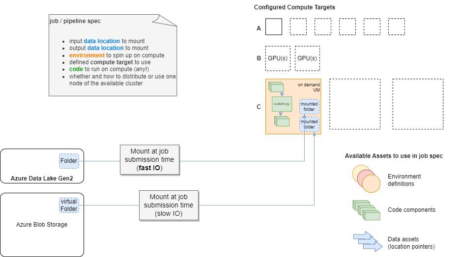
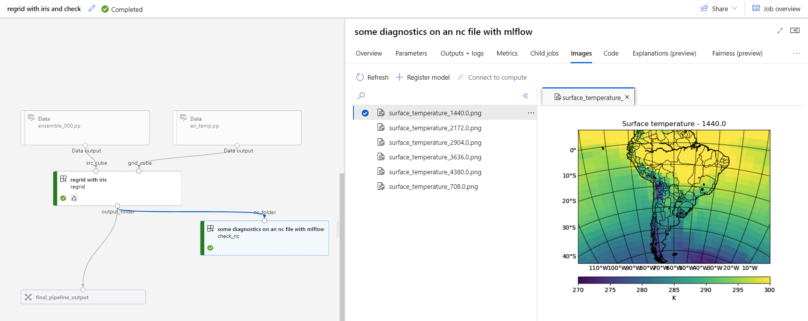
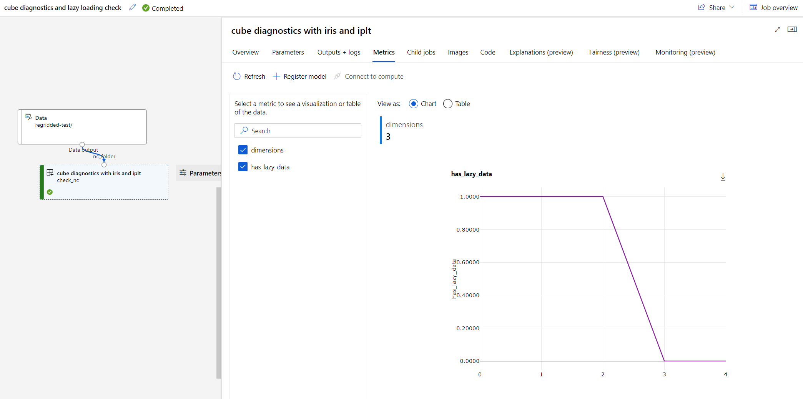

# Regridding with AML v2 Pipelines

This example uses sample data that is available from within the [IRIS python library](https://scitools-iris.readthedocs.io/en/latest/index.html) for processing and analysing gridded Earth Science data.

Here, we demonstrate a scenario where that data is not obtained via the library package, but instead already exists in Azure Storage. 

The sample data can be obtained [here](https://github.com/SciTools/iris-sample-data/tree/main/iris_sample_data/sample_data/), and the relevant files need to be uploaded manually to a previously configured Azure ML linked datastore to run this example. In this example, the linked datastore is called `azuregigdatalake_bronze`, referring to the bronze container of an Azure datalake (gen2).

👉 sample directory [here](./), start with reviewing [pipeline 2](./pipelines/2-pipeline-two-step.yml), and the [components](./components) it references.

> ▶️ Quickstart: To run the pipeline with the [Azure ML cli v2](https://learn.microsoft.com/en-us/azure/machine-learning/how-to-configure-cli?tabs=public), update the data locations in the pipeline yml to point to your datastore locations, and ensure a compute target named `cpu-cluster` exists in your workspace. Then run `az ml job create pipelines/2-pipeline-two-step.yml` 

The pipeline components read the data from mounted storage location, and write the result out again to mounted storage.

The image below illustrates mounting data locations on job submission:

Output of [pipeline 1](./pipelines/1-pipeline-one-step.yml) in the Azure ML job portal:

## Mlflow logging

Logging diagnostic images to the pipeline run with mlflow

Verifying lazy loading of the iris cube data mounted within the compute, using mlflow metrics logging.

## Parallel Jobs

[todo]

Learning
- parallel job is very similar to PRS
- deployed code requires azureml-core

References
- https://learn.microsoft.com/en-us/azure/machine-learning/reference-yaml-job-parallel 
- https://learn.microsoft.com/en-us/azure/machine-learning/how-to-use-parallel-job-in-pipeline?tabs=cliv2 
- https://github.com/Azure/azureml-previews/tree/main/previews/pipelines/samples/tf_mnist
