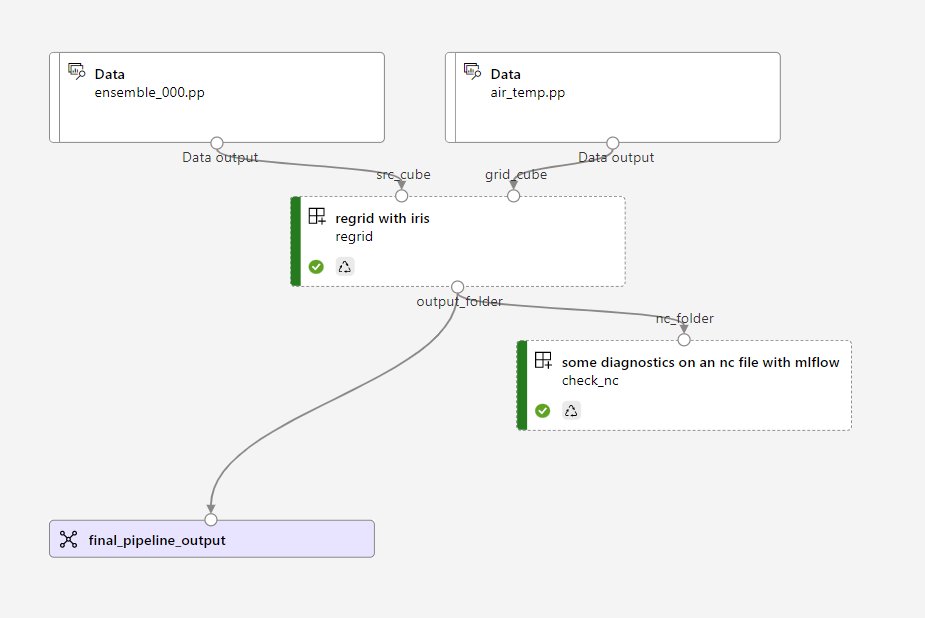

# Regridding with AML v2 Pipelines

This example uses sample data that is available from within the [IRIS python library](https://scitools-iris.readthedocs.io/en/latest/index.html) for processing and analysing gridded Earth Science data.

Here, we demonstrate a scenario where that data is not obtained via the library package, but instead already exists in Azure Storage. 

The sample data can be obtained [here](https://github.com/SciTools/iris-sample-data/tree/main/iris_sample_data/sample_data/), and the relevant files need to be uploaded manually to a previously configured Azure ML linked datastore to run this example. In this example, the linked datastore is called `azuregigdatalake_bronze`, referring to the bronze container of an Azure datalake (gen2).

The pipeline components read the data from mounted storage location, and write the result out again to mounted storage.

The image below illustrates mounting data locations on job submission:

Output of [pipeline 1](./pipelines/1-pipeline-one-step.yml) in the Azure ML job portal:

## Mlflow logging

Logging diagnostic images to the pipeline run with mlflow

Verifying lazy loading of the iris cube data mounted within the compute, using mlflow metrics logging.

## Parallel Jobs

[todo]